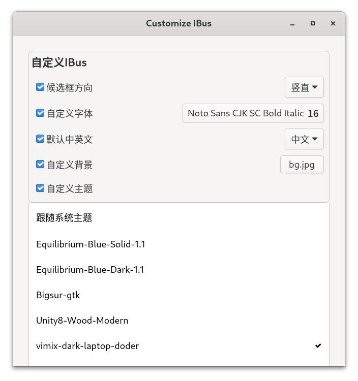
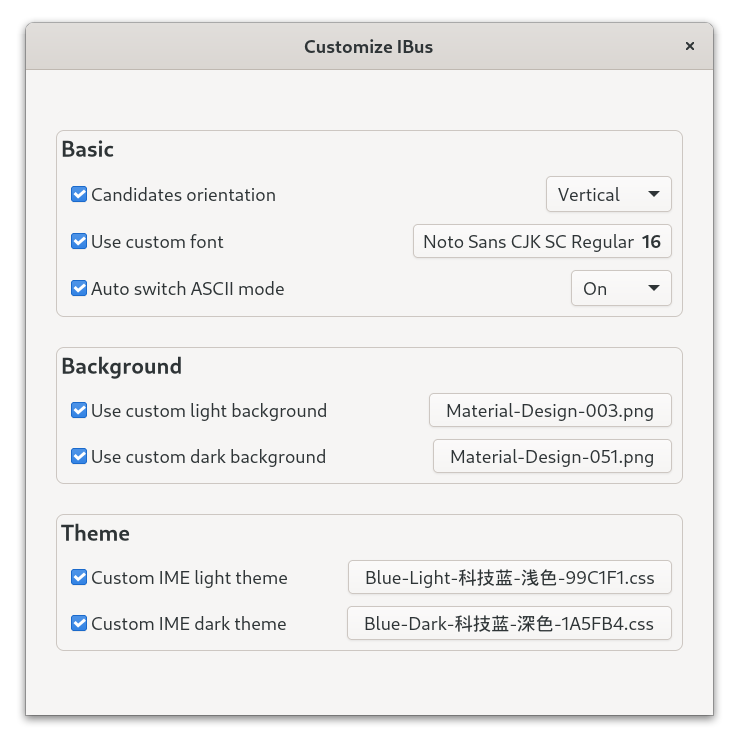

# 自定义IBus

[](https://github.com/HollowMan6/Customize-IBus/graphs/commit-activity)
[](../../releases)

[](https://github.com/HollowMan6?tab=followers)
[](https://github.com/HollowMan6/Customize-IBus/watchers)
[](https://github.com/HollowMan6/Customize-IBus/stargazers)
[](https://github.com/HollowMan6/Customize-IBus/network/members)

[](https://hollowman6.github.io/fund.html)
[](https://opensource.org/licenses/GPL-3.0/)
[](https://github.com/HollowMan6/Customize-IBus/archive/main.zip)

[](https://lgtm.com/projects/g/HollowMan6/Customize-IBus/alerts/)
[](https://lgtm.com/projects/g/HollowMan6/Customize-IBus/context:javascript)

(English version is down below)

在GNOME Shell中更改IBus的候选框方向、主题、字体和输入法默认语言。


## 安装

从GNOME扩展商店中获取：

[][EGO]

或者手动自行安装：

```bash
git clone https://github.com/HollowMan6/Customize-IBus.git
cd Customize-IBus && make install
```

## 功能



## 使用用户主题来更改IBus皮肤的实现

当用户从主题列表中选中一个主题，本扩展会首先读取该主题的定义CSS文件，从中提取出定义IBus皮肤的类样式(`.candidate-*`)，然后将其写入本扩展的`stylesheet.css`文件。最后重启GNOME-shell。

### *提示：* 
1. 推荐使用X11。如果你在Wayland中更改IBus主题，你的当前所有工作都将会丢失，因为Wayland下只支持通过重新登陆来重启GNOME-shell。
2. 在Fedora 33和Ubuntu 20.04, GNOME-shell 3.38中通过了测试。

## 备忘

- [X] 从[ibus-tweaker](https://github.com/tuberry/ibus-tweaker)中导入，去除与IBus无关功能。
- [X] 从用户主题中读取IBus相关样式
- [X] 将相关功能合并在一起。

## 致谢

1. [ibus-font-setting](https://extensions.gnome.org/extension/1121/ibus-font-setting/)
2. [ibus-tweaker](https://github.com/tuberry/ibus-tweaker)
3. [user-theme](https://gitlab.gnome.org/GNOME/gnome-shell-extensions/-/tree/master/extensions/user-theme)
4. [shell-restarter](https://github.com/koolskateguy89/gnome-shell-extension-shell-restarter)

*该项目是谷歌编程之夏 (GSoC) 2021于[OpenSUSE](https://github.com/openSUSE/mentoring/issues/158)社区成果的一部分。*

# Customize IBus

Customize IBus in GNOME Shell for orientation, theme, font and input mode auto-switch.


## Installation
[][EGO]

Or manually:

```bash
git clone https://github.com/HollowMan6/Customize-IBus.git
cd Customize-IBus && make install
```

## Features



## Realization of Customizing IBus with User Theme

When user chooses a theme from the list, this extension will first read the theme CSS file, extract the IBus related style classes (`.candidate-*`), then write it to extension's `stylesheet.css`. Finally restart the GNOME-shell.

### *NOTE:* 
1. Recommend to use X11. If you change IME theme under Wayland, all your current work may be lost (Since Wayland only support relogin to restart the GNOME-shell).
2. Tested on Fedora 33 and Ubuntu 20.04, GNOME-shell 3.38.

## To-do

- [X] Import from [ibus-tweaker](https://github.com/tuberry/ibus-tweaker) and remove features unrelated to IBus.
- [X] Read from user themes and apply only for ibus.
- [X] Merge functions related together.

## Acknowledgements

1. [ibus-font-setting](https://extensions.gnome.org/extension/1121/ibus-font-setting/)
2. [ibus-tweaker](https://github.com/tuberry/ibus-tweaker)
3. [user-theme](https://gitlab.gnome.org/GNOME/gnome-shell-extensions/-/tree/master/extensions/user-theme)
4. [shell-restarter](https://github.com/koolskateguy89/gnome-shell-extension-shell-restarter)

*This project is part of the achievement of the Google Summer of Code 2021 at [OpenSUSE](https://github.com/openSUSE/mentoring/issues/158).*

[EGO]:https://extensions.gnome.org/extension/4112/customize-ibus/
