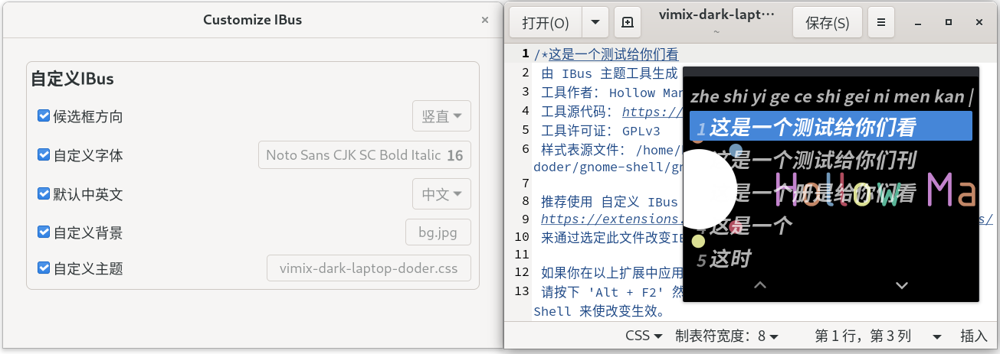

# 自定义 IBus

[](https://github.com/openSUSE/Customize-IBus/graphs/commit-activity)
[](../../releases)

[](https://opensource.org/licenses/GPL-3.0/)
[](https://github.com/openSUSE/Customize-IBus/archive/main.zip)

[](https://lgtm.com/projects/g/openSUSE/Customize-IBus/alerts/)
[](https://lgtm.com/projects/g/openSUSE/Customize-IBus/context:javascript)

### 欢迎在 Weblate 中贡献你的翻译！

[](https://hosted.weblate.org/engage/ibus-customize/)

[English](README.md)

深度定制 IBus 的外观、行为、系统托盘以及输入指示。

[自定义 IBus 操作指南](GUIDE_CN.md)



## 安装

从 GNOME 扩展商店中获取：

[][ego]

### Linux

手动自行安装：

```bash
git clone https://github.com/openSUSE/Customize-IBus.git
cd Customize-IBus && make install
```

如果你使用 Arch Linux, 也可使用 AUR 安装为系统插件:

```bash
yay -S gnome-shell-extension-customize-ibus
```

[](https://aur.archlinux.org/packages/gnome-shell-extension-customize-ibus/)

[Fedora](../../tree/package-repo#fedora)也可使用 RPM Repository 安装为系统插件:

```bash
wget https://github.com/openSUSE/Customize-IBus/raw/package-repo/customize-ibus-rpm.repo
sudo mv customize-ibus-rpm.repo /etc/yum.repos.d/
sudo dnf update
sudo dnf install gnome-shell-extension-customize-ibus
```

[OpenSUSE](../../tree/package-repo#opensuse)也可使用 RPM Repository 安装为系统插件:

```bash
wget https://github.com/openSUSE/Customize-IBus/raw/package-repo/customize-ibus-rpm.repo
sudo mv customize-ibus-rpm.repo /etc/zypp/repos.d/
sudo zypper refresh
sudo zypper install gnome-shell-extension-customize-ibus
```

或者直接通过[ymp 文件](gnome-shell-extension-customize-ibus.ymp)安装。

[Debian 系(Ubuntu)](../../tree/package-repo#debianubuntu) 也可使用 Debian Repository 安装为系统插件:

```bash
echo "deb http://opensuse.github.io/Customize-IBus/deb/ /" | sudo tee -a /etc/apt/sources.list.d/customize-ibus-deb.list > /dev/null
wget -q -O - http://opensuse.github.io/Customize-IBus/hollowman.pgp | sudo apt-key add -
sudo apt update
sudo apt install gnome-shell-extension-customize-ibus
```

[Ubuntu PPA](https://launchpad.net/~hollowman86/+archive/ubuntu/customize-ibus)

```bash
sudo add-apt-repository ppa:hollowman86/customize-ibus
sudo apt-get update
```

你可以通过 [OpenSUSE OBS](https://software.opensuse.org//download.html?project=home%3Ahollowman&package=gnome-shell-extension-customize-ibus) 下载绝大部分 Linux 发行版对应的相关安装包后安装。

对于 Gentoo，运行以下命令安装为系统插件:

```bash
git clone https://github.com/openSUSE/Customize-IBus.git
cd Customize-IBus && make emerge
```

对于 NixOS:

```bash
sudo nix-env -i gnomeExtensions.customize-ibus
```

对于 Guix:

```bash
curl -o /tmp/guix.scm https://raw.githubusercontent.com/openSUSE/Customize-IBus/main/guix.scm
guix package -f /tmp/guix.scm
```

### FreeBSD

手动自行安装：

```sh
git clone https://github.com/openSUSE/Customize-IBus.git
cd Customize-IBus && gmake install
```

也可使用 Pkg Repository 安装为系统插件:

```sh
wget https://github.com/openSUSE/Customize-IBus/raw/package-repo/customize_ibus.conf
sudo mkdir -p /usr/local/etc/pkg/repos/
sudo mv customize_ibus.conf /usr/local/etc/pkg/repos/
sudo pkg update
sudo pkg install gnome-shell-extension-customize-ibus
```

## 功能

支持自定义：

- 候选框方向
- 候选框动画
- 右键单击候选框以切换输入源或打开任务栏菜单
- 候选框上滚动以切换页面或候选词
- 固定候选框使其不跟随光标以及设定固定位置
- 候选框字体
- 输入模式根据应用记忆并自动切换
- 更改候选框透明度
- 固定输入法列表顺序
- 拖拽移动候选框
- 显示或隐藏候选框调页按钮
- 系统任务栏托盘显示和交互设置
  - 显示或隐藏托盘图标
  - 直接点击托盘图标切换输入源
  - 添加额外菜单
- 输入源指示器及其显示和交互设置
  - 启用指示器
  - 仅在切换输入法时指示
  - 仅在英文输入时指示
  - 使用单模式输入法时不指示
  - 右击指示器来将其隐藏
  - 指示器上滚动来切换输入源
  - 指示器显示动画
  - 自定义字体
  - 左击指示器以拖拽移动或者切换输入源
  - 更改透明度
  - 启用延时显示以及配置显示时延
  - 启用自动隐藏以及配置自动隐藏时延
- 皮肤样式主题（提供的或者从 GNOME Shell 主题中提取的样式表，参见扩展的帮助部分来获取更多指导）
- 候选框背景图片及其显示样式
- 主题和背景图片跟随 GNOME 夜灯

### 输入源指示器


### 动画

开启滑动:


### 拖拽移动


### 固定输入法列表顺序

在切换输入法时指示的每次显示顺序都固定而不是从中间开始依次循环。

应用前:


应用后:


导入自 [Fixed IME List](https://extensions.gnome.org/extension/3663/fixed-ime-list/)，更多增加此功能的原因请参考这里： https://github.com/AlynxZhou/gnome-shell-extension-fixed-ime-list#why

### 使用用户主题来更改 IBus 皮肤的实现

该功能已经被拆分，生成 IBus 皮肤样式表功能迁移到了[IBus-Theme-Tools](https://github.com/openSUSE/IBus-Theme-Tools)。

目前该扩展支持导入该工具生成的样式表。另外还支持[IBus-Theme-Hub](https://github.com/openSUSE/IBus-Theme-Hub)中提供的 IBus 主题样式表文件。

当浅色主题和深色主题同时开启时，扩展将会自动跟随 GNOME 夜灯模式，关闭时使用浅色主题，开启时使用深色主题。

当浅色主题和深色主题只有一个被开启时，扩展将会始终使用那个开启的主题。

**注：** ~~如你的 IBus 样式表在应用后作出了更改，请关闭并重新开启对应`自定义主题`来使其生效。~~ 从 v69 开始，支持样式表热重载, CSS 的变化会实时地体现出来。

#### IBus Tweaker 中的主题

IBus Tweaker 中提供的主题已经被制作成为 IBus 主题样式表合集[仿微软 Microsoft](https://github.com/openSUSE/IBus-Theme-Hub/tree/main/%E4%BB%BF%E5%BE%AE%E8%BD%AFMicrosoft)，欢迎下载使用!

#### _提示：_

1. 对于那些不使用 GNOME 而是使用如 KDE，XFCE 等桌面环境的用户，更改 IBus GTK 主题也请使用另外一个项目[IBus-Theme-Tools](https://github.com/openSUSE/IBus-Theme-Tools)。
2. 如非调试需要，请勿在 IBus 主题样式表中加入非`.candidate-*`开头的类，以免干扰系统主题。

### 更改 IBus 背景图片的实现

在[修复 Unity8-Wood 主题对 IBus 背景支持](https://github.com/openSUSE/mentoring/issues/158#issuecomment-813837436)时发现为`.candidate-popup-content`增加如下样式：

```css
background: url("assets/bg.png");
background-repeat: no-repeat;
background-size: cover;
```

即可实现对背景的修改。

进一步结合[ibus-font-setting](https://extensions.gnome.org/extension/1121/ibus-font-setting/)和[background-logo](https://pagure.io/background-logo-extension)，参考 GNOME-Shell 源代码中`candidate-popup-content`样式[对应组件](https://gitlab.gnome.org/GNOME/gnome-shell/-/blob/master/js/ui/ibusCandidatePopup.js#L154)，并对其修改样式实现不重启 GNOME-Shell 进行 IBus 背景图片的修改。

支持设定图片显示模式为：居中，铺满，裁剪，以及重复模式。

当浅色背景和深色背景同时开启时，扩展将会自动跟随 GNOME 夜灯模式，关闭时使用浅色背景，开启时使用深色背景。

当浅色背景和深色背景只有一个被开启时，扩展将会始终使用那个开启的背景。

**注：** 请确保背景图片始终可以访问，如你的图片存放在可移动设备，系统默认不挂载，每次手动挂载后请关闭并重新开启对应`自定义背景`来使其生效。

## 日志

- [x] 从[ibus-tweaker](https://github.com/tuberry/ibus-tweaker)中导入，去除与 IBus 无关功能。
- [x] 从用户主题中读取 IBus 相关样式
- [x] 将相关功能合并在一起。
- [x] V4: 从 GTK3 升级到 GTK4 来适配 GNOME40。
- [x] V8: 增加更改 IBus 背景图片功能。
- [x] V13: 将从 GNOME-Shell 主题提取 IBus 样式功能剥离，使用 Python 下 CSS 解析器而并非正则表达式实现功能，生成额外 IBus 样式表供用户修改测试使用。
- [x] V13: 本扩展改为接受用户提供的 IBus 样式表进行样式的应用。
- [x] V16: 修改主题加载逻辑，免去每次更换主题都要重启 GNOME-Shell。
- [x] V18: 增加浅色和深色背景与主题，跟随 GNOME 夜灯模式自动切换。
- [x] V18: 重构代码。
- [x] V20: 更改 UI；增加帮助页面。
- [x] V22: 重新设计 UI。
- [x] V24: 增加背景图片显示模式配置。
- [x] V26: 增加背景图片显示重复模式配置。
- [x] V28: 增加打开扩展配置选项到 IBus 输入源指示面板中。
- [x] V30: 增加记住输入状态选项。
- [x] V32: 更改扩展 logo 以及 UI 界面。
- [x] V36: 增加托盘菜单项修改和启动/重启 IBus 按钮。
- [x] V38: 增加 IBus 版本显示，输入源指示器。
- [x] V40: 修复输入源指示器定时关闭缺陷，增加更多配置。增加 IBus 输入框弹出动画配置功能。
- [x] V42: 增加拖拽移动功能。
- [x] V44: 重构拖拽移动功能使其更健壮。
- [x] V46: 修复一些 BUGs，增加右键关闭指示器功能。
- [x] V48: 增加候选框右击切换输入源；支持显示或隐藏托盘图标，直接点击托盘切换输入源。
- [x] V50: 增加候选框右击打开菜单，点击输入指示器切换菜单功能。
- [x] V52: 增加固定候选框功能。
- [x] V54: 修复对于 ibus-rime 的候选框右击和指示器的支持。
- [x] V55: 将 3.38 和 40 合并在一起；更改一些 UI。
- [x] V56: 更改 UI；增加恢复默认设置选项；清理代码。
- [x] V57: 增加功能，可以备份和恢复当前设置到文件中。
- [x] V58: 增加图标，使得可以直接从设置面板打开文件；将设置备份文件扩展名从*.dconf 改为*.ini。
- [x] V59: 增加固定输入法列表顺序的功能和启动官方自定义设置的按钮。
- [x] V60: 为指示器增加自定义字体功能；增加显示或隐藏候选框调页按钮配置；优化背景显示功能。
- [x] V61: 增加候选框上滚动以切换页面或候选词，指示器上滚动来切换输入源。
- [x] V62: 修复和 ibus-setup（首选项）设置同步问题。
- [x] V63: 修复污染 GNOME Shell 环境问题。
- [x] V64: 修复英文拼写错误，指示器滚动控制。
- [x] V65: 将项目转移至 openSUSE。
- [x] V66: 增加对 openSUSE Leap 15.3 的支持。
- [x] V67: 进一步修复对 openSUSE Leap 15.3 的支持。
- [x] V68: 增加更改透明度功能。
- [x] V69: 增加主题样式表热重载支持。
- [x] V70: 为 GSoC 2021 最终提交做修复和优化。
- [x] V72: 增加 GNOME 41 支持；增加功能使得可以重设来更随系统主题和背景。
- [x] V75: 修复对 wayland 的支持和拖拽移动的一些 bug； 重排 UI。
- [x] V76: 支持使用单模式输入法时隐藏指示器；支持输入源指示器显示时延。
- [x] V77: 支持当切换窗口或输入法时立刻显示指示器，即使已经启用了显示延迟。
- [x] V78: 清理并修复几个 Bugs。

在 Fedora，OpenSUSE，Manjaro，Ubuntu 和 FreeBSD，GNOME-shell [3.38](../../tree/3.38)(v3，v5，v9，v11，v14，v15，v17，v19，v21，v23，v25，v27，v29，v31，v35，v37，v39，v41，v43，v45，v47，v49，v51，v53(之后的合并进了主版本))，40.0(v4，v8，v10，v12，v13，v16，v18，v20，v22，v24，v26，v28，v30，v32，v36，v38，v40，v42，v44，v46，v48，v50，v52，v54)，3.38 和 40(v55，v56，v57，v58，v59，v60，v61，v62，v63，v64，v65，v66)，3.34，3.36，3.38 和 40(v67，v68，v69，v70)，41(v72，v75，v76，v77，v78)中通过了测试。

## 致谢

1. [ibus-font-setting](https://extensions.gnome.org/extension/1121/ibus-font-setting/)
2. [ibus-tweaker](https://github.com/tuberry/ibus-tweaker)
3. [fixed-ime-list](https://github.com/AlynxZhou/gnome-shell-extension-fixed-ime-list)

_该项目曾是[@HollowMan6](https://github.com/HollowMan6)参与[谷歌编程之夏 (GSoC) 2021](https://summerofcode.withgoogle.com/archive/2021/projects/6295506795364352/) 于[OpenSUSE](https://github.com/openSUSE/mentoring/issues/158)社区成果的一部分。_

[ego]: https://extensions.gnome.org/extension/4112/customize-ibus/
